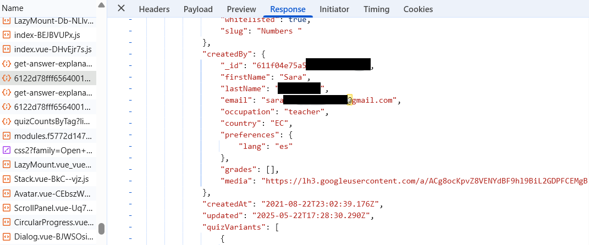

# English

# Quizizz API Data Exposure Report

## Description

This repository documents a finding concerning an API request from the [Quizizz](https://quizizz.com) platform that potentially exposes personal data of a quiz creator (notably their email address), publicly accessible via a specific URL.

Discovery date: 2025-05-22.

## Context

When accessing a quiz from the Quizizz admin interface, for example:

https://quizizz.com/admin/quiz/<quiz_id>

The site automatically performs a request to the following API endpoint:

https://quizizz.com/_quizserver/main/v2/quiz/<quiz_id>?convertQuestions=false&includeFsFeatures=true&sanitize=read&questionMetadata=true&includeUserHydratedVariants=true

## Problem

The JSON response from this request contains detailed quiz metadata, including:

- The quiz creator’s email address  
- The full name of the creator  
- Other user profile information  

This data is returned without authentication, only requiring the quiz ID — which may constitute a personal data leak.

## Potential Impacts

- Violation of user privacy  
- Risk of large-scale scraping of emails and personal information  

## Demonstration

A Python script is included in this repository to demonstrate how creator information can be extracted using just a quiz link.

## Disclaimer

This repository is intended solely for educational and awareness purposes. It does not promote or support any misuse or malicious exploitation of the described vulnerability.

---------------------

# Français

# Rapport d’exposition de données via l’API Quizizz

## Description

Ce dépôt documente une découverte concernant une requête API de la plateforme [Quizizz](https://quizizz.com) qui expose potentiellement des données personnelles du créateur d’un quiz (notamment l’adresse email), accessibles publiquement via une URL spécifique.

Découverte effectuée le 22/05/2025.

## Contexte

Lorsqu’on consulte un quiz via l’interface d’administration de Quizizz, par exemple :

https://quizizz.com/admin/quiz/<id_quiz>

Le site exécute automatiquement une requête vers l’API suivante :

https://quizizz.com/_quizserver/main/v2/quiz/<id_quiz>?convertQuestions=false&includeFsFeatures=true&sanitize=read&questionMetadata=true&includeUserHydratedVariants=true

## Problème

La réponse JSON renvoyée par cette requête contient des métadonnées détaillées sur le quiz, y compris :

- L’adresse email du créateur
- Le nom complet du créateur
- D’autres informations de profil utilisateur

Ces données sont accessibles sans authentification, uniquement avec l’ID du quiz, ce qui constitue une fuite d’informations personnelles.

## Impacts potentiels

- Atteinte à la vie privée des créateurs de contenus
- Risque de scraping massif d’adresses email et d’autres données sensibles

## Démonstration

Un script Python est fourni dans ce dépôt pour démontrer comment récupérer ces informations à partir d’un simple lien vers un quiz.

## Avertissement

Ce dépôt a uniquement un objectif pédagogique et de sensibilisation à la sécurité des données. Il ne vise en aucun cas à encourager ou faciliter une utilisation malveillante de cette vulnérabilité.
